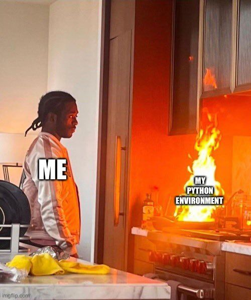
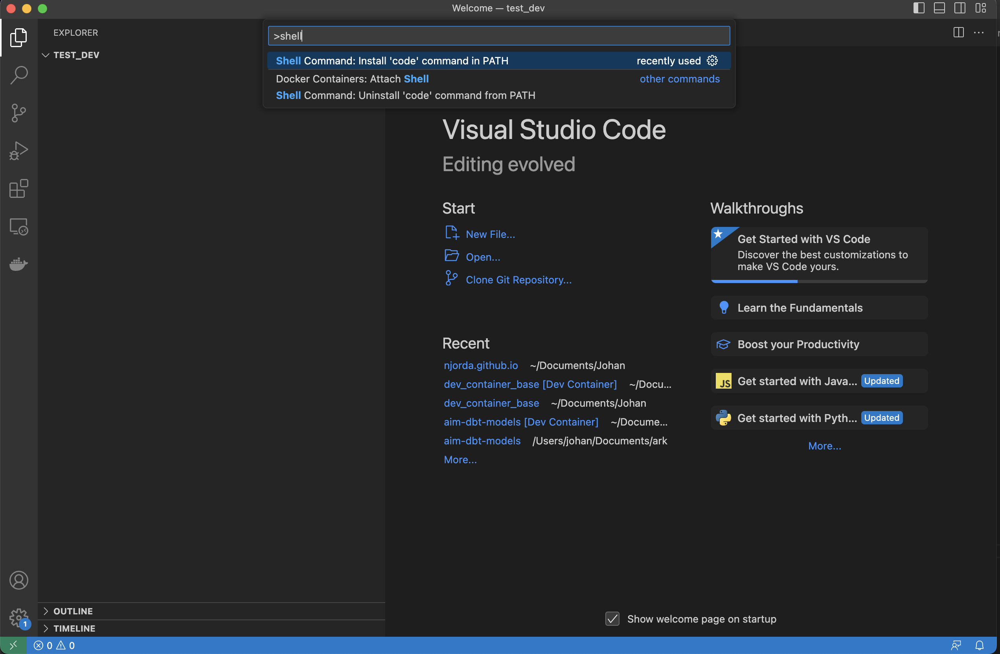
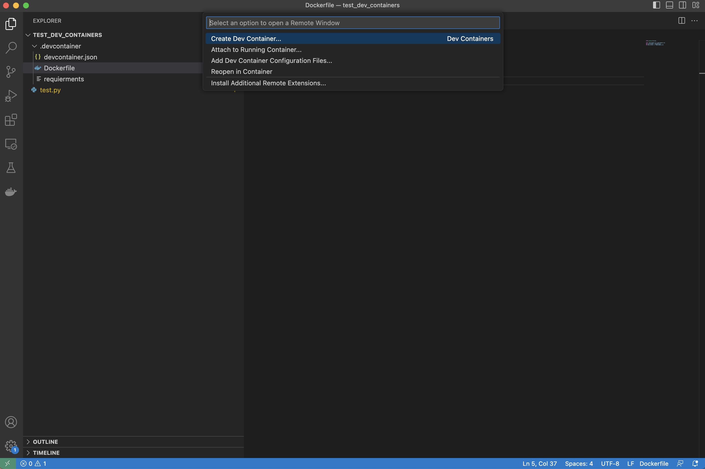

# VS docker Dev Container
Are you tired of dealing with messy, inconsistent development environments that slow down your workflow? Look no further than VS Code dev containers, a powerful feature in Visual Studio Code that can streamline your development process and improve consistency across different environments.

In this post, we'll dive into what dev containers are and how you can use them to supercharge your development workflow. We'll also walk through how to set up a dev container for a Python environment and you will get an understsnding how easy it is to get started.



## What Are VS Code Dev Containers?
VS Code dev containers are a container-based approach to development environments that allow you to create lightweight, isolated environments with all the tools and dependencies you need to build and run your code. By using a container-based approach, dev containers are designed to be portable and reproducible, making it easier to share your development environment with others and ensure consistency across different environments.

With dev containers, you can work with different programming languages and frameworks without having to install and configure them on your local machine. This means you can create a consistent and reproducible development environment, regardless of the host operating system.

## Setting Up a Python Dev Container 


To get started with dev containers, you'll first need to install [Docker](https://docs.docker.com/desktop/install/mac-install/) and [Visual Studio Code](https://code.visualstudio.com/download) if you haven't already. Once you have VS Code installed, you can follow these steps to set up a dev container for a Python environment:

```
Open Visual Studio Code
Open the command pallette with Command + Shift + P (or F1)
Type Shell in command palette
Select Shell Command: Install code in PATH from suggested list
```


There are a lot of pre-built containers, but here we are going to add a custom one that we can build on in later posts. 

Create a new empty folder from your terminal and open VS Code in that folder.
```bash 
    mkdir test_dev_containers 
    cd test_dev_containers
    code . 
```

VS Code will now open up, and you will have an empty folder. The first step is to create a map called .devcontainer. When later starting the dev container, VS Code will automatically understand that this folder is where the container to use has been specified.

```bash 
mkdir .devcontainer 
```

There are also three additional files needed: a Dockerfile, a devcontainer.json file telling VS Code how to start the dev container, and last but not least a requirements.txt file where Python packages can be specified.

```bash
touch .devcontainer/devcontainer.json
touch .devcontainer/Dockerfile
touch .devcontainer/requirements.txt
```

To add pandas to the requirements run the following command
```bash
echo  $'pandas==1.5.3' >.devcontainer/requirements
```

To have something to test on we can also create a small python file importing pandas and printing hello world. 

```bash 
touch test.py
echo  $'import pandas as pd \nprint("hello world") '> test.py
```

It is now time to specify the dockerfile, the dockerfile will specify what will be used to run the enviroment.
```bash
FROM python:3.9-slim

COPY requirements.txt requirements.txt 
RUN pip install --upgrade pip
RUN pip install -r requirements.txt 
```


The last part to config is the devcontainer.json file

```json
{
    "build": { "dockerfile": "Dockerfile" },
  
    "customizations": {
      "vscode": {
        "extensions": ["dbaeumer.vscode-eslint"]
      }
    },
    "forwardPorts": [3000]
  }
```

The file tells vs-code what the name of the dockerfile is, and we specify that we want vs code to instal eslint and forward port 3000. There are a lot of possabilites to customize here but for now this is enough. 

## Running a python script in the dev container 

If you push the green bar in the bottom left corner of vs code a popup will show up with the option to "reopen in devcontainer" push it and the container will build this will take any where from a few seconds to a couple of minutes depending on the size of your container. 



When it is done push open up a new terminal in vs code and run the comand below.

```python
python test.py
```

It should give you the folowwing result:

```bash 
hello world
```