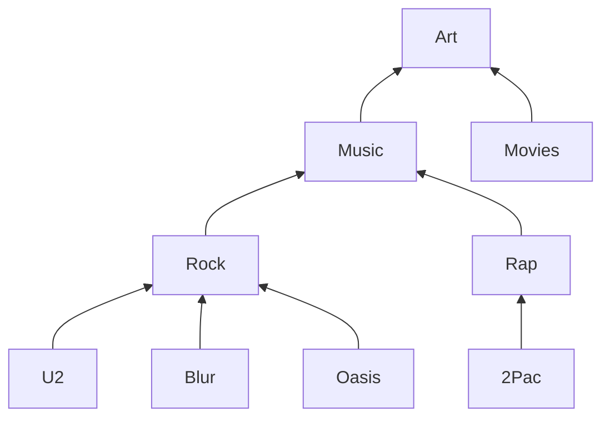

In this blog post we will go over some learnings from writing recursive queries. For example data we will use the [Recursive queries]() blog post and the set up provided in the post as well, and thus not go over how to bring up the env in this post. 


# Avoiding cycles

Writing `Recursive` queries it is easy to have cycles that. For a process at work I tried to do a graph traversal but ended up in a infinite loop, to avoid spilling sensitive information we will rely on a mock example based upon [this example](https://duckdb.org/docs/sql/query_syntax/with.html). However the learning is still the same. The goal was to try to get all the nodes while traversing the graph. I was aiming for getting something like: 


| id       | name          | parent |
|----------|:-------------:|-------:|
| 4        | 2Pac          | 6      |
| 6        | Rap           | 7      |
| 7        | Music         | 9      |
| 9        | Art           |        |


and tried to write the following query: 

```SQL
WITH RECURSIVE steps(id, name, subclassof) AS (
    SELECT id, name, subclassof 
    FROM tag
    WHERE name='2Pac'
  UNION ALL
    SELECT tag.id, tag.name, tag.subclassof
    FROM tag, steps
    WHERE steps.subclassof=tag.id
)
SELECT * FROM steps LIMIT 100;
```
This queries ends up in an infinite loop. To get some kind of limit you can add `LIMIT 100`. Adding a limit clause is in general a good thing while doing development in order to reduce the risk for putting the database under load(as well as try to never do development on top of a active production database in order to not affect the application performance). The main issue is that since I return the `step.id` as the `node(id,...)` this will continue to match with the same row all over again. This could also have been avoided using `UNION` instead of `UNION ALL` . The correct query however is instead: 


```SQL
WITH RECURSIVE steps(id, name, subclassof) AS (
    SELECT id, name, subclassof 
    FROM tag
    WHERE name='2Pac'
  UNION ALL
    SELECT tag.id, tag.name, tag.subclassof
    FROM tag, steps
    WHERE steps.subclassof=tag.id
)
SELECT * FROM steps LIMIT 100;
```

Potentially I could also have switched the `UNION ALL` for `UNION` but this is also not supported for all databases(which is actually the case for the one I used at work).

# Combining multiple CTE:s with Recursive queries

In the case of using the output of a previous CTE with a recursive query the syntax is slightly different, where the recursive keyword is moved to the first CTE statement even though it is related to a later query. In order to simply my recursive query I tried to use a CTE for making the recursive query simpler and thus write something like: 

```SQL
WITH tmp AS (
    SELECT id, name, subclassof
    FROM tag
), RECURSIVE steps(id, name, subclassof) AS (
    SELECT id, name, subclassof 
    FROM tmp
    WHERE name='2Pac'
  UNION ALL
    SELECT tmp.id, tmp.name, tmp.subclassof
    FROM tmp, steps
    WHERE steps.subclassof=tmp.id
)
SELECT * FROM steps LIMIT 100;
```

However this will not work, which confused me and I found the answer hard to find, after trial and error but ended up figuring out that the structure should be the following: 

```SQL
WITH RECURSIVE  tmp AS (
    SELECT id, name, subclassof
    FROM tag
), steps(id, name, subclassof) AS (
    SELECT id, name, subclassof 
    FROM tmp
    WHERE name='2Pac'
  UNION ALL
    SELECT tmp.id, tmp.name, tmp.subclassof
    FROM tmp, steps
    WHERE steps.subclassof=tmp.id
)
SELECT * FROM steps LIMIT 100;
```

# When to use `WHERE` and when to use `JOIN`

Obviously using a filtering and joining rows are not the same thing however similar results can be achieved. Thus this comes down to how YOU like to get the data out and what results you are looking for. Learning about recursive queries it felt like black magic and thus I though it was worth writing something about it. For example if we like to get the the path between nodes in a graph. If we start with the same data as in the previous examples the graph looks like this: 



If we want to have the path between  Oasis and Music we could use the following query: 

```sql
WITH RECURSIVE steps(id, name, subclassof) AS (
    SELECT id, name, subclassof 
    FROM tag
    WHERE name='2Pac'
  UNION ALL
    SELECT tag.id, tag.name, tag.subclassof
    FROM tag, steps
    WHERE steps.subclassof=tag.id
)
SELECT * FROM steps;
```

Which gives: 

| id       | name          | parent |
|----------|:-------------:|-------:|
| 4        | 2Pac          | 6      |
| 6        | Rap           | 7      |
| 7        | Music         | 9      |
| 9        | Art           |        |

However we could also do it using a join and keeping the paths as a array. 


```sql
WITH RECURSIVE steps(startNode, endNode, path) AS (
    SELECT id as startNode
        , subclassof as endNode
        , ARRAY[id,subclassof] 
    FROM tag
    WHERE name='2Pac'
  UNION ALL
    SELECT steps.startNode
        , tag.subclassof
        , steps.path || subclassof AS path
    FROM steps
    JOIN tag ON steps.endNode=tag.id
    WHERE tag.subclassof != ALL(steps.path)
)
SELECT * FROM steps;
```

This gives the following result: 

 startnode | endnode |   path
-----------+---------+-----------
         4 |       6 | {4,6}
         4 |       7 | {4,6,7}
         4 |       9 | {4,6,7,9}

However we could also get the path from doing the following:


```SQL
WITH RECURSIVE steps(id, name, path) AS (
    SELECT tag.subclassof
        , name
        , ARRAY[id] 
    FROM tag
    WHERE name='2Pac'
  UNION ALL
    SELECT tag.subclassof
        , steps.name
        , steps.path || tag.subclassof
    FROM tag, steps
    WHERE steps.id=tag.id
    AND tag.subclassof IS not null
)
SELECT * FROM steps LIMIT 10;
```

Which gives:

```sql
SELECT * FROM steps LIMIT 10;
 id | name |  path
----+------+---------
  6 | 2Pac | {4}
  7 | 2Pac | {4,7}
  9 | 2Pac | {4,7,9}
```

Probably the title of the section is not that good, since the conclusion is the obvious answer that it depends on that you looking for(as always there is multiple ways to get there)


# Optimizations

As with any Query indexes can improve performance for the variables used for filtering(`WHERE`) and joining(`JOIN`) data together. Therefore make sure to run tests, use `EXPLAIN ANALYSE` in order to add indexes to increase performance. 

