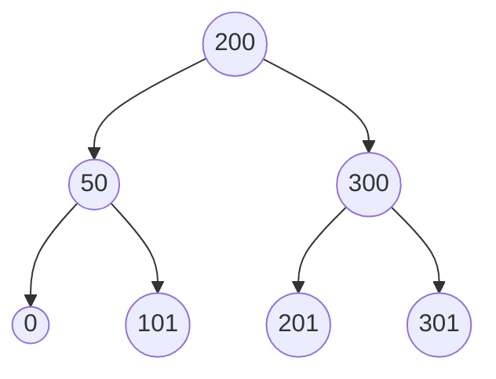

# Consistent hashing

In this blog post we will dive in to consistent hashing and implement it in go. Lets start with a problem that consistent hashing would help solve. Imagine we have a distributed systems with 3 database. Business is booming and we realize we need to scale out to more shards. Lets assume we selected which node to send the data to using a hash function f(x) and get the node: 

```python
node = hash(id)%3
```

The downside with this is that if we like to add a node, almost all data points would move hash: 

```python
1 = hash("hello")%3
1 = hash("car")%3
1 = hash("now")%3
0 = hash("sound")%3
1 = hash("snow")%3
0 = hash("apple")%3
```

vs

```python
1 = hash("hello")%4
0 = hash("car")%4
1 = hash("now")%4
2 = hash("sound")%4
3 = hash("snow")%4
1 = hash("apple")%4
```

As we can se in this case we would move 5 out of 6 values. We would like to shuffle as little data around as possible(of course we want to move some values to the new node). This is where Consistent Hashing comes in. Lets assume we have a hashing function that hash to values in the range of 0 -> 400, normally we would of course have a hashing function with a larger range. 

We would set our nodes to handle a range and naturally with three nodes we would set: 

node 1: 0-> 133
node 2: 133-> 266
node 3: 266 -> 400

If we decide to add a node we would then split the range between one of these nodes and thus end up with something like: 

node  1: 0-> 88
node `1: 88-> 133 
node  2: 133-> 266
node  3: 266 -> 400

Now we just rearrange a small part of the values. However we only broke up one range. In order to solve this we introduce the concept of virtual nodes. Instead of mapping each nodes to a specific range we split the range (0->400) in to multiple smaller sections where N> number of nodes. Something like: 


```
node a 0-> 50
node b 50-> 100
node c 150-> 200
node d 200-> 250
node e 250-> 300
node f 300 -> 350
node f 350-> 400
```

we would then map this to the actual nodes: 

```
node 1: 0 -> 50 & 200->250 & 350 -> 400
node 2: 50 -> 100 & 250->300
node 3: 150 -> 200 & 300 -> 350
```

We could add any number of virtual nodes to split the data up. If we now add a new node: 

```
node 1: 0 -> 50 
node 2: 50 -> 100 & 250->300
node 3: 150 -> 200 & 300 -> 350
node 4: 200->250 & 350 -> 400
```

In this case we can avoid hot key ranges better and also add new node while minimizing the number of values that are shuffled. 


# Consistent Hashing Implementation


We will walk over how to implement this first and then do a `go` implementation. 

The first step is to find the actual node of interest for a specific key, this can be done with a Binary Search Tree(BST) or a sorted list where we iterate over and find the key. 



Using a BST the time complexity is log(n) where n is the time it takes to find which nodes have the value of interest. The brute force solution would be to check all the nodes and see which ranges they have. With few nodes that would be very fast and we don't need to have a binary search tree. 

When adding nodes we will add a number virtual nodes in order to get a better balance between the nodes and avoid hot nodes. We will focus on an implementation where we use a sorted list and thus each time we add a new node(and multiple virtual nodes) we have to update the sorted list of nodes. 

When we want to find which nodes holds our value we do the following: 
1) hash the value
2) take the modulus(based upon the number of virtual nodes) as key
3) loop over the virtual nodes and check the start value of each of them, if the start value is larger than our key, take the previous node. 

And we are done. 


# Consistent hashing, distributed key value store.  

To start of we use a sorted list of the nodes instead of a binary tree, this will be slightly less performance: 

```go
package ring

import (
	"fmt"
	"hash"
	"hash/fnv"
	"sort"
)

// Way to slow and uninspiring
// Time to implement consistent hashing instead
// This is my ring :)

type virtualNode struct {
	node string
	// We should be able to call the node as well here ...
	start uint32
}

type Ring struct {
	nodes []virtualNode
	hash  hash.Hash32
	// Mapping from virtual node to the actual node
	// This is needed when we delete a node
	NodeMapping map[string][]string
}

func New() *Ring {
	return &Ring{
		nodes:       []virtualNode{},
		hash:        fnv.New32(),
		NodeMapping: map[string][]string{},
	}
}

func (r *Ring) Len() int           { return len(r.nodes) }
func (r *Ring) Swap(i, j int)      { r.nodes[i], r.nodes[j] = r.nodes[j], r.nodes[i] }
func (r *Ring) Less(i, j int) bool { return r.nodes[i].start < r.nodes[j].start }

// Add adds a new node -> number of virtual nodes to the ring
func (r *Ring) Add(node string, nbrVirtualNode int) error {
	if nbrVirtualNode < 1 {
		return fmt.Errorf("nbrVirtualNode needs to be larger than  0, currently %v", nbrVirtualNode)
	}
	for i := 0; i < nbrVirtualNode; i++ {
		// Never assume the buffer is clean, be defensive
		r.hash.Reset()
		_, err := r.hash.Write([]byte(fmt.Sprintf("%s_%v"node,i)))
		if err != nil {
			return fmt.Errorf("write hash: %v", err)
		}
		r.nodes = append(r.nodes, virtualNode{
			node:  node,
			start: r.hash.Sum32(),
		})
		sort.Sort(r)
	}
	return nil
}

// GetNode gets the node
func (r *Ring) GetNode(key string) (string, error) {
	// Never assume the buffer is clean, be defensive
	r.hash.Reset()
	_, err := r.hash.Write([]byte(key))
	if err != nil {
		return "", fmt.Errorf("write hash: %v", err)
	}
	hash := r.hash.Sum32()

	// TODO: continue here to fix the issues with the tests
	// We want to use all virtual nodes ...
	// set the first node to 0?
	// The last node will not be used currently
	// We need to make it circular
	for idx, node := range r.nodes {
		if idx == 0 {
			return r.nodes[len(r.nodes)-1].node, nil
		}
		if node.start > hash {
			return r.nodes[idx-1].node, nil
		}
	}
	return r.nodes[0].node, nil
}

// RemoveNodes removes the actual node
// Data will not be moved, we just drop the nodes
func (r *Ring) RemoveNode(node string) error {
	return nil
}

```

# Next steps

In a later blog post we will implement a distributed Key value store and use our Consistent Hashing function to distribute the keys. 

# More reading

Random sources I found useful: 

- [Blog post](http://highscalability.com/blog/2023/2/22/consistent-hashing-algorithm.html#:~:text=Consistent%20hashing%20is%20a%20distributed,of%20nodes%20changes%20%5B4%5D.)
- [Gist](https://github.com/gholt/ring/blob/master/BASIC_HASH_RING.md)